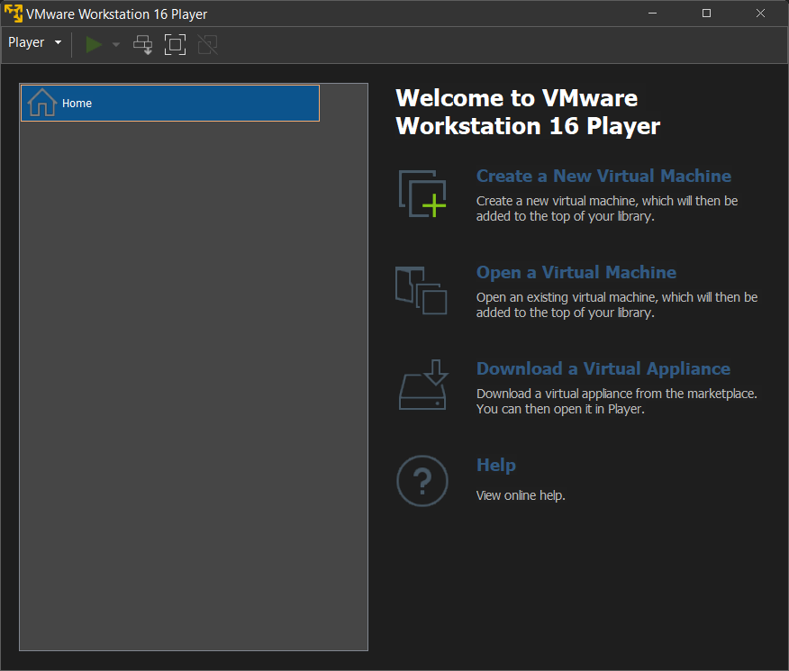
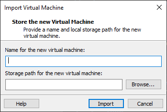

# CSC8426: Emerging Technologies - Docker Platform
This repository contains essential materials and references for the practicals of CSC8426 Emerging Technologies module. Please read https://docs.docker.com/engine/docker-overview/ before doing the exercises.

## Pre-Requisites

### For ARM Macs

1. Install Docker for Apple Chip ( https://docker.com )

### For Windows or Intel Macs

1. Download and install VMWare player (https://www.vmware.com/products/workstation-player.html)

2. Download Virtual Machine Image (with Docker Pre-Installed): https://bit.ly/3ZLrblg

3. Open VMWare player and import the virtual machine



4. Provide a name and storage location



5. If you need sudo access in the VM, the username and password is `cloud`/`cloud`

6. If you get an error relating to Hyper-V (Windows 10 users only), please update your system

### For Linux

1. Run this following command to install Docker

`curl https://get.docker.com | sh`

### Referenece materials
1. Container Introduction
https://www.youtube.com/watch?v=EnJ7qX9fkcU

## Task 1: Deploy a web application component in Docker Environmen

### 1. Tutorial Video
Task1 Emerging Technologies Coursework https://bit.ly/3nR14sy

### 2. Additional Hints
It is a basic docker job which has to be performed using Command line (Refer https://docs.docker.com/get-started/part2/#run-the-app)

## Task 2: Deploy a complex web application stack in Docker Environment

### 1. Tutorial Video

Task2 Introduction to Docker Swarm https://bit.ly/3lBvuwh
### 2. Explanation References
1. Docker Swarm Intro
https://www.youtube.com/watch?v=Tm0Q5zr3FL4
Refer https://docs.docker.com/engine/swarm/ for basic concepts
2. Docker Engine SDK and API
Docker provides an API for interacting with the Docker daemon (called the Docker Engine API), as well as SDKs for Go and Python. There are unofficial libraries for other programming languages. If you choose to use Java as your programming language, you may use https://github.com/spotify/docker-client. Unofficial libraries don't come with all the features. Some provide control over basic docker engine features only.
The SDKs allow you to build and scale Docker apps and solutions quickly and easily. If Go or Python won’t work for you, you can use the Docker Engine API directly or any other language third-party SDKs for 
The Docker Engine API is a RESTful API accessed by an HTTP client such as wget or curl, or the HTTP library which is part of most modern programming languages.
Refer https://docs.docker.com/develop/sdk/
Python SDK Reference : https://docker-py.readthedocs.io/en/stable/

3.  locustio/locust
	1. Basic features
	https://github.com/locustio/locust
	1. Running in Docker
	https://docs.locust.io/en/stable/running-locust-docker.html
	
4.  Mongo Database
	1. Official Website
	https://www.mongodb.com
	1. Docker QuickStart
	https://hub.docker.com/_/mongo

5. Google cAdvisor Remote REST API Reference
	1. Pattern of API endpoint
		```
		http://<hostname>:<port>/api/<version>/<request>
		```
		
		The current version of the API is v1.3 and there is a beta release of the v2.0 API
		
    	Supported request types: &quot;containers,docker,events,machine,subcontainers&quot;
		
    	Example: 
		```
		http://localhost:8888/api/v1.3/containers
		```
    	
		The result is returned in JSON format.
		
	2. To get information of all sub containers 
		```
		http://localhost:8888/api/v1.3/subcontainers/
		```
		
	3. To get information of a specific sub container 
		```
		http://localhost:8888/api/v1.3/subcontainers/<subcontainername>
		```
		
	Refer https://github.com/google/cadvisor/blob/master/docs/api.md

6. Docker Swarm Visualizer
Refer: https://github.com/dockersamples/docker-swarm-visualizer

### 3. Additional Hints
Refer the docker-compose.yml file in https://docs.docker.com/get-started/part5/#add-a-new-service-and-redeploy 

## Task 3: Build your own Docker image and push it to the Docker Hub

### 1. Tutorial Video

Task3 Docker Build Toturial https://bit.ly/3nWhsIx

### 2. Additional Hints
You can download the source code of the provided Java program in this link https://github.com/ncl-iot-team/cadvisor-scraper

Before you push the new built docker image to the remote Docker Hub repository, please don't forget to login with your Docker Hub account in command link interface, and tag your built image with "&lt;your username&gt;/&lt;image name&gt;". 

## Task 4: Fully deploy and run the complex web application stack and undertakeperformance benchmarking activities

### 1. Tutorial Video

Task4 Introduction to cAdvisor https://bit.ly/3x47sR3

### 2. Additional Hints

When you plan to verify the container statistics recorded in the MongoDB instance, you can try to deploy a mongodb express service, refer https://github.com/mongo-express/mongo-express which can be deployed in Docker environment, ref https://hub.docker.com/_/mongo-express/
