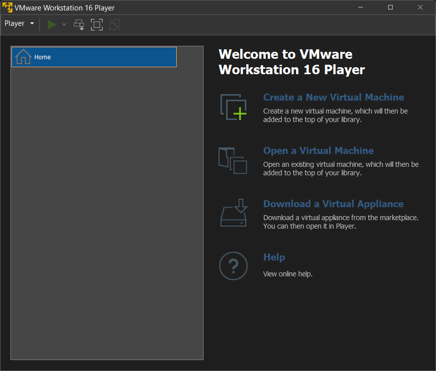
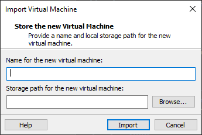

# Local machine instructions

### For ARM Macs

1. Install Docker for Apple Chip ( https://docker.com )
2. Install Rosetta 2 ( `softwareupdate --install-rosetta` )

### For Windows or Intel Macs

1. Download and install VMWare player (https://www.vmware.com/products/workstation-player.html)

2. Download Virtual Machine Image (with Docker Pre-Installed): https://bit.ly/3ZLrblg

3. Open VMWare player and import the virtual machine

4. Provide a name and storage location

5. If you need sudo access in the VM, the username and password is `cloud`/`cloud`

6. If you get an error relating to Hyper-V (Windows 10 users only), please update your systemi

### For Linux

1. Run this following command to install Docker

`curl https://get.docker.com | sh`